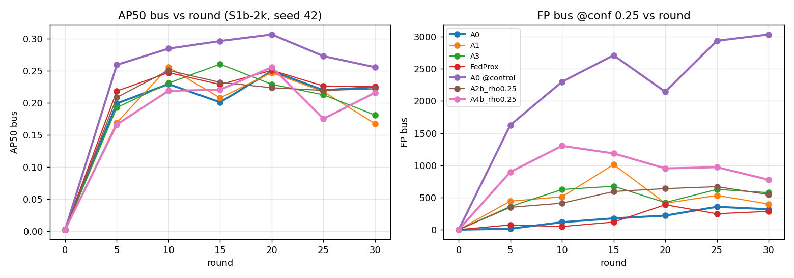

# Phân tích đồ án FLOPS: Federated Object Detection dưới Missing-Class Non-IID

> Cập nhật 2026-10-04. Mọi con số trong tài liệu này lấy từ **(a)** code trong repo, **(b)** source
> Ultralytics 8.3.253 / Flower 1.21.0 đã ghim phiên bản, hoặc **(c)** các lần chạy Kaggle đã ghi trong
> `research/experiment_registry/`. Nhãn bằng chứng theo CLAUDE.md §4:
> `[YOLO-DOC]` source Ultralytics · `[FL-DOC]` source Flower · `[LITERATURE]` bài báo đã kiểm trong
> `research/evidence/literature_registry.yaml` · `[ĐO]` số đo thực nghiệm · `[SUY LUẬN]` lập luận
> từ số liệu, chưa được kiểm chứng riêng · `[GIẢ THUYẾT]` giả thuyết luận văn, cần thực nghiệm.

---

## 0. Tóm tắt định lượng

| Câu hỏi | Trả lời ngắn | Căn cứ |
|---|---|---|
| Bài toán là gì? | Huấn luyện YOLOv8n liên kết (4 client) khi **một số client không có lớp nào đó** (bus/truck) | §1, §3 |
| Thiệt hại nằm ở đâu? | Lớp hiếm bị thiệt nặng **ngay cả khi dữ liệu IID**: FedAvg so với centralized giảm AP50 car −6,0 %, truck −21,5 %, bus −32,8 %, motorcycle −59,4 % | `[ĐO]` §5.2 |
| Cơ chế gây quên? | Với client không có bus, BCE chỉ sinh **gradient đẩy logit bus xuống**: 134.400 số hạng âm mỗi batch 16 ảnh, 0 số hạng dương | `[YOLO-DOC]` + tính toán §3.1 |
| Phần tham số "riêng của lớp"? | Chỉ **780 / 3.022.085 phần tử (0,026 %)**: 6 tensor `cv3.{0,1,2}.2` | `[ĐO]` F1 §2.3 |
| Phương pháp đề xuất làm gì? | A3: gộp hàng tham số của lớp *c* chỉ từ client có lớp *c*; A2b: nhân BCE của lớp vắng với ρ = 0,25 (giảm 4× áp lực đẩy xuống); A4b = A2b + A3 | §4 |
| Missing-Class có gây hại không? | **Có, ở cả 3 seed**: FedAvg trên S1b mất **−0,046 ± 0,008** AP50 bus so với đối chứng matched, chủ yếu do bỏ sót bus (FN +487 ± 63) | `[ĐO]` §5.6 |
| Phương pháp đề xuất có khắc phục được không? | **Không** ở dạng hiện tại: A4b **−0,014 ± 0,002** AP50 bus so với FedAvg ở cả 3 seed (FP bus +696, FN −72); A3 −0,024, A2b −0,010 (1 seed) | `[ĐO]` §5.5–5.6 |
| Thiệt hại do phân bố hay do ít dữ liệu? | **Cả hai**: cùng dữ liệu chia đều (D3) tốt hơn S1b **+0,029** AP50 bus; phần còn lại (+0,018) do ít box bus (seed 42) | `[ĐO]` §5.7 |
| Bus bị bỏ sót đi đâu? | Phần lớn bị **nhầm thành truck/car** (+204 / +202 so với control), +193 không phát hiện | `[ĐO]` D1 §5.7 |
| Hướng mới A5 (FedNTD), A6 (EFL)? | **Bác bỏ** theo quy tắc khai báo trước: −0,024 và −0,075 AP50 bus so với FedAvg | `[ĐO]` §5.7 |
| Khi server có 1.000 ảnh có nhãn? | Teacher T + **chưng cất từ T cố định (P1)**: 0,300 AP50 bus, **+0,025 so với pre-train (B1), +0,029 so với fine-tune ở server (B2)** — đạt cả hai điều kiện ADR-015 (1 seed); bảo toàn ρ không thêm gì | `[ĐO]` §5.8 |
| Độ tin cậy? | 3 seed cho A0, A0@control, A4b (std A0 = 0,003 AP50 bus); các arm khác 1 seed. Thăm dò: G4/G5 chưa pass | §5.6 |

---

## 1. Thuật ngữ

| Thuật ngữ | Định nghĩa dùng trong đồ án |
|---|---|
| **Federated Learning (FL)** | Nhiều *client* huấn luyện cục bộ trên dữ liệu riêng, chỉ gửi tham số mô hình cho *server*; server gộp thành mô hình toàn cục. Dữ liệu không rời client. |
| **Round** | Một vòng: server gửi mô hình toàn cục → mỗi client train cục bộ → server gộp. Ở đây: 1 round = **1 epoch cục bộ** trên dữ liệu của client. |
| **IID / Non-IID** | IID: dữ liệu các client cùng phân phối. Non-IID: khác phân phối. Các dạng chính: *label distribution skew* (tỉ lệ lớp khác nhau), *quantity skew* (số mẫu khác nhau), và trường hợp cực đoan **missing-class** (một client có **0 mẫu dương** của một lớp). |
| **Missing-Class Non-IID** | Client có **0 box** của lớp *c*. Trong đồ án, client "thiếu bus" **không chứa ảnh nào có bus** (loại cả ảnh, không chỉ xóa nhãn), để bus không thành *hard-negative* sai (plan.md §5). |
| **Client drift** | Mô hình cục bộ trôi về tối ưu của dữ liệu riêng, lệch khỏi tối ưu toàn cục. Đây là mục tiêu của FedProx/SCAFFOLD. |
| **Catastrophic forgetting** | Kiến thức đã học (ở đây: phát hiện bus) bị xóa khi tiếp tục train trên dữ liệu không có nó. |
| **Class head / hàng lớp** | Lớp conv 1×1 cuối nhánh phân loại của YOLOv8 (`model.22.cv3.<s>.2`), mỗi lớp có **một hàng** trọng số (64 giá trị) + 1 bias ở mỗi scale *s* ∈ {P3, P4, P5}. |
| **Logit / BCE** | Logit *z* = đầu ra trước sigmoid; xác suất *p* = σ(*z*). YOLOv8 dùng **Binary Cross-Entropy** độc lập cho từng lớp, *không* softmax. |
| **Anchor point** | Mỗi ô lưới của 3 feature map dự đoán một box; ảnh 640 px có 80² + 40² + 20² = **8.400** anchor. |
| **TAL (Task-Aligned Assigner)** | Bộ gán của YOLOv8: mỗi box thật nhận tối đa `topk = 10` anchor dương; các anchor còn lại là âm cho mọi lớp. |
| **AP / mAP50 / mAP50-95** | AP = diện tích dưới đường precision-recall của một lớp. mAP50 = trung bình AP ở IoU 0,5; mAP50-95 = trung bình trên IoU 0,50…0,95. |
| **conf = 0,001 vs 0,25** | AP được tính ở ngưỡng **0,001** (chuẩn Ultralytics khi validate) để có toàn bộ đường PR; **FP/FN** đếm ở ngưỡng vận hành **0,25** (ADR-009). |
| **FP / FN** | False positive (dự đoán sai) / false negative (bỏ sót box thật), theo confusion matrix ở conf 0,25, IoU 0,45. |
| **EMA** | Exponential Moving Average của trọng số do Ultralytics duy trì; trọng số client gửi lên là EMA bản fp32 (ADR-008). |
| **AMP** | Automatic Mixed Precision (fp16/fp32) khi train trên GPU. |
| **Matched control** | Partition đối chứng giống hệt S1b về số ảnh và số box các lớp không-mục-tiêu, **khác duy nhất ở có/không bus**, để tách hiệu ứng thiếu lớp khỏi các yếu tố gây nhiễu (CLAUDE.md §10). |
| **Ablation A0–A4b** | Các biến thể bật/tắt từng thành phần của phương pháp (§4). |
| **Gate G0–G11** | Cổng kiểm soát tiến trình nghiên cứu (CLAUDE.md §7); không được nhảy cổng. |

---

## 2. Các thành phần của đồ án

### 2.1 Dữ liệu BDD100K (4 lớp mục tiêu) `[ĐO]`

| Lớp | bbox train | ảnh train chứa lớp | % ảnh train | bbox val | ảnh val chứa lớp |
|---|---:|---:|---:|---:|---:|
| car | 713.211 | 69.072 | 98,9 % | 102.506 | 9.879 |
| truck | 29.971 | 18.890 | 27,3 % | 4.245 | 2.689 |
| **bus** | 11.672 | 8.993 | 13,0 % | 1.597 | 1.242 |
| motorcycle | 3.002 | 2.284 | 3,3 % | 452 | 334 |

- 69.271 ảnh train dùng được (69.863 có nhãn, 592 không chứa lớp mục tiêu); 10.000 ảnh val.
- **Mất cân bằng cực mạnh**: car có số box gấp 61× bus và 238× motorcycle.
- **Kiểm chéo evaluator:** ở round 0 (mô hình chưa phát hiện gì), FN = 102.506 / 1.597 / 4.245 / 452,
  trùng khít số box val ở bảng trên. Như vậy evaluator đọc đúng toàn bộ nhãn val.
- **Hệ quả thiết kế:** car không thể là lớp vắng (98,9 % ảnh có car); motorcycle quá ít (452 box val)
  để đo hiệu ứng có ý nghĩa thống kê → **bus là lớp mục tiêu chính**, truck thứ cấp (plan.md quyết định D1).

### 2.2 Partition (cách chia dữ liệu cho client)

Ba kịch bản, đều do `src/data/partitioner.py` sinh tất định theo seed và lưu `manifest.yaml`.

| Kịch bản | Mô tả | Mục đích |
|---|---|---|
| **S0** (IID) | Chia đều ngẫu nhiên | Kiểm tra phương pháp không làm hại trường hợp bình thường |
| **S1b** | C0, C1: **0 bus**; C2: 0 truck; C3: đủ 4 lớp | Kịch bản Missing-Class chính |
| **S1-Control-Matched** | Từ S1b, **hoán đổi tối thiểu** ảnh không-bus của C0/C1 lấy ảnh có bus, giữ nguyên số ảnh và vector box các lớp khác | Đối chứng nhân quả cho H1 |

**S1b-2k thực tế** (2.000 ảnh/client, dùng trong phiên 5) `[ĐO]`:

| Client | car | **bus** | truck | motorcycle | lớp vắng |
|---|---:|---:|---:|---:|---|
| C0 | 20.664 | **0** | 1.012 | 89 | bus |
| C1 | 20.524 | **0** | 841 | 71 | bus |
| C2 | 20.944 | 732 | **0** | 109 | truck |
| C3 | 20.700 | 635 | 1.586 | 78 | — |
| **Tổng** | 82.832 | **1.367** | 3.439 | 347 | |

**Đối chứng matched-2k** `[ĐO]`: bus = 683 / 683 / 732 / 683 (tổng **2.781**); car của C0 lệch
20.664 → 20.654 (−0,05 %), các lớp không-mục-tiêu khác giữ nguyên → `match_report: matched = true`.

> ⚠️ **Lưu ý định lượng khi đọc H1:** tổng box bus của đối chứng gấp **2,03×** S1b (2.781 so với 1.367).
> So sánh S1b với đối chứng vì vậy đo hiệu ứng gộp của **(i) bus vắng ở 2/4 client** và
> **(ii) ít hơn một nửa lượng giám sát bus**. Đây là bản chất của việc "thiếu lớp" (bỏ client có
> lớp đi thì mất cả dữ liệu lớp đó), nhưng phải được nêu rõ khi kết luận.

### 2.3 Mô hình YOLOv8n (4 lớp) `[ĐO]` `[YOLO-DOC]`

Đếm bằng `research/feasibility/F1/verify_map.py` trên stack Kaggle đã ghim (torch 2.7.1+cu128):

| Nhóm | Phần tử | Tỉ lệ | Vai trò |
|---|---:|---:|---|
| backbone (`model.0–9`) | 1.277.707 | 42,28 % | Trích đặc trưng, dùng chung mọi lớp |
| neck (`model.10–21`) | 990.738 | 32,78 % | Kết hợp đa tỉ lệ (PAN-FPN), dùng chung |
| detect_reg (`cv2`) | 382.662 | 12,66 % | Hồi quy box, **không phụ thuộc lớp** |
| detect_cls (`cv3`) | 370.962 | 12,28 % | Nhánh phân loại |
| └─ **class head** (`cv3.<s>.2`) | **780** | **0,026 %** | **Phần duy nhất có hàng riêng cho từng lớp** |
| detect_dfl | 16 | ~0 % | Tích phân DFL cố định |

- Class head = 3 scale × (weight 4×64 + bias 4) = 780 phần tử; mỗi lớp sở hữu đúng **195 phần tử**.
- Bias khởi tạo `[YOLO-DOC]` `bias_init = ln(5/nc/(640/s)²)`: −8,541 / −7,155 / −5,768 cho stride 8/16/32
  (xác suất 1,95·10⁻⁴ / 7,8·10⁻⁴ / 3,1·10⁻³), khớp giá trị quan sát trong checkpoint.
- Từ COCO-pretrained chỉ truyền được **319/355** key: toàn bộ 36 key của `cv3` bị khởi tạo lại, vì
  kênh ẩn của cv3 phụ thuộc nc (`c3 = max(ch[0], min(nc,100))`: 64 với nc=4, 80 với nc=80) (ADR-008).

### 2.4 Huấn luyện cục bộ (mỗi client, mỗi round) `[YOLO-DOC]`

| Thiết lập | Giá trị | Ghi chú |
|---|---|---|
| Optimizer | SGD, lr0 = 0,01, momentum 0,937, weight decay 5·10⁻⁴ | mặc định Ultralytics |
| Batch / nbs | 16 / 64 → gộp gradient 4 batch cho mỗi bước | |
| Số bước tối ưu mỗi round | ⌈2000/16⌉ / 4 ≈ **31** (S1b-2k) | |
| Loss | `7,5·box(CIoU) + 0,5·cls(BCE) + 1,5·DFL` | hệ số mặc định `box/cls/dfl` |
| AMP | bật | |
| EMA | decay = 0,9999·(1−e^(−u/2000)); với u ≈ 31 bước/round → **0,015**, tức EMA ≈ trọng số thô | |
| Warm-up / close_mosaic | 0 / 0 cho round FL (1 epoch); 3 / 10 cho centralized G2 | ADR-009 |

### 2.5 Server và chiến lược gộp (Flower 1.21) `[FL-DOC]`

Server chạy `flwr.simulation` với 4 client (Ray actor), mỗi GPU chạy một client (`client_num_gpus: 1.0`).
Sau mỗi round, server lưu checkpoint và, theo `eval_every`, đánh giá mô hình toàn cục trên **toàn bộ
10.000 ảnh val** (cùng một evaluator cho mọi phương pháp).

### 2.6 Đánh giá

- AP/mAP ở conf 0,001; FP/FN ở 0,25 (một lượt validate duy nhất nhờ cơ chế có sẵn của Ultralytics,
  `utils/metrics.py: conf = 0.25 if conf in {None, 0.001}`) `[YOLO-DOC]`.
- Thống kê confidence theo lớp ở ngưỡng 0,25 (F2/F3).

### 2.7 Hạ tầng (không phải đóng góp khoa học nhưng quyết định tính đúng)

Các lỗi đã tìm và sửa, mỗi lỗi đều làm sai hoặc làm mất kết quả: model nc=80 so với nc=4; trọng số client
bị làm tròn fp16; `val()` fuse model tại chỗ; stdout pipe đầy gây treo; giới hạn 500 file output của Kaggle;
tên metric MLflow không hợp lệ; seed G2 không được truyền; FedProx/SCAFFOLD/A2b từng là vỏ rỗng
(ADR-008 … ADR-011).

---

## 3. Vì sao Missing-Class làm hỏng mô hình: phân tích định lượng

### 3.1 Gradient của BCE trên client thiếu bus `[YOLO-DOC]` + tính toán

Với một anchor và lớp *c*: ℓ = −[t·log σ(z) + (1−t)·log(1−σ(z))] ⇒ **∂ℓ/∂z = σ(z) − t**.

- Trên client **không có bus**, mọi anchor đều có t_bus = 0 ⇒ ∂ℓ/∂z_bus = σ(z_bus) **> 0 ở mọi anchor**:
  gradient luôn đẩy logit bus **xuống**, không bao giờ kéo lên.
- Số số hạng mỗi batch: 16 ảnh × 8.400 anchor = **134.400 số hạng âm** cho bus, **0 số hạng dương**.
- Trên C2 (có bus): 732 box / 2.000 ảnh = 0,366 bus/ảnh; với `topk = 10`, mỗi batch có tối đa
  ≈ 16 × 0,366 × 10 ≈ **59 anchor dương** cho bus so với ~134.341 anchor âm.
- Hệ quả `[SUY LUẬN]`: ở mô hình đã biết bus, σ(z_bus) trên các vùng "giống bus" lớn, nên gradient đẩy
  xuống lớn chính ở những vùng đó. Đây là cơ chế quên trực tiếp lên **hàng bus của class head** và gián
  tiếp lên **đặc trưng dùng chung** (qua backprop vào backbone/neck/cv3 chung).

### 3.2 Pha loãng khi gộp tham số

FedAvg gộp mỗi tham số theo số ảnh: w_i = n_i / Σn_j. Trong S1b-2k, mọi client có 2.000 ảnh ⇒ **w_i = 0,25**.

Với hàng bus của class head:
θ_bus^(t+1) = 0,25·(θ_bus,C0 + θ_bus,C1) **[2 client chỉ đẩy xuống]** + 0,25·(θ_bus,C2 + θ_bus,C3).

⇒ **50 % "khối lượng" cập nhật** của hàng bus đến từ client không thể học bus. Với truck: 25 % (C2).

### 3.3 Quên có thể nằm ngoài class head `[SUY LUẬN]`

Class head chỉ chiếm 0,026 % tham số; **99,97 %** còn lại là dùng chung. Nếu phần lớn thiệt hại cho bus
nằm ở đặc trưng dùng chung, thì mọi cơ chế **chỉ can thiệp vào hàng lớp** (A1, A3, A2a) sẽ bị giới hạn.
Đây chính là câu hỏi F2/F3 phải trả lời (G5, Gate A/B/C): chưa đo, không được giả định.

### 3.4 Thiệt hại cho lớp hiếm có sẵn kể cả khi IID `[ĐO]`

Phiên 2 (S0 IID, 1 seed): FedAvg đạt **77,2 %** mAP50 của centralized, và tỉ lệ thiệt tăng theo độ hiếm
(car −6,0 % → motorcycle −59,4 %). Vì vậy hiệu ứng Missing-Class phải được đo **so với đối chứng matched**,
không so với centralized.

---

## 4. Các phương pháp và công thức

Ký hiệu: θ^t là mô hình toàn cục ở round *t*; θ_i là mô hình sau khi client *i* train cục bộ;
n_i là số ảnh của client *i*; n_i^c là số box lớp *c* ở client *i*.

### 4.1 Baseline

| Phương pháp | Công thức / cơ chế | Nhắm vào | Trạng thái |
|---|---|---|---|
| **FedAvg** `[LITERATURE]` McMahan et al. 2017 | θ^(t+1) = Σ_i (n_i/N)·θ_i | — | ✅ |
| **FedProx** `[LITERATURE]` Li et al. 2020 | Client tối thiểu F_i(w) + (μ/2)‖w − θ^t‖²; gradient thêm μ(w − θ^t); μ = 0,01 | Client drift do dữ liệu dị biệt | ✅ (ADR-010) |
| **SCAFFOLD** `[LITERATURE]` Karimireddy et al. 2020 | Hiệu chỉnh gradient bằng biến điều khiển (c − c_i) | Client drift | ⛔ **chặn**: client cũ không hiệu chỉnh, sai công thức Δc_i, K sai, mất c_i giữa round |
| **FedNova** `[LITERATURE]` Wang et al. 2020 | Chuẩn hóa cập nhật theo số bước cục bộ τ_i | Không nhất quán mục tiêu | chưa chạy |

> FedProx và SCAFFOLD chống **trôi tham số nói chung**; không phương pháp nào trong chúng biết client nào
> **thiếu lớp nào**. Vì vậy chúng không nhắm trực tiếp vào cơ chế §3.1–§3.2 `[SUY LUẬN]`.

### 4.2 Phương pháp đề xuất (bài của đồ án) `[GIẢ THUYẾT]`

**H3 — gộp nhận biết lớp ở server (A3)**, chỉ áp cho 6 tensor class head:
- S_c = { i : n_i^c ≥ τ_elig }, τ_elig = 1
- w_i^c = n_i^c / Σ_{j∈S_c} n_j^c
- θ^(t+1)[c] = θ^t[c] + Σ_{i∈S_c} w_i^c·(θ_i[c] − θ^t[c])
- **S_c = ∅ ⇒ giữ nguyên θ^t[c]** (luật no-contributor). Phần tham số còn lại gộp theo FedAvg.

**A1 — đối chứng class-count**: w_i^c = n_i^c / Σ_j n_j^c trên **mọi** client, không có ngưỡng và không có luật no-contributor.

Trọng số thực tế cho **hàng bus** trong S1b-2k:

| | C0 | C1 | C2 | C3 |
|---|---:|---:|---:|---:|
| FedAvg | 0,250 | 0,250 | 0,250 | 0,250 |
| A1 = A3 | **0** | **0** | 0,535 | 0,465 |

**Định danh toán học A3 ≡ A1 trong S1b** `[SUY LUẬN, chứng minh được]`: vì τ_elig = 1, client có n_i^c = 0
đóng góp trọng số 0 ở cả hai công thức, nên mẫu số bằng nhau; dạng delta với Σw = 1 cho cùng tổ hợp lồi.
Hai công thức chỉ khác khi S_c = ∅ (không client nào có lớp *c*), mà điều này **không bao giờ xảy ra** trong
S1b (bus có ở C2 và C3; truck có ở C0, C1, C3). Hệ quả:
1. Trong S1b, **A3 và A1 phải cho kết quả như nhau**; mọi chênh lệch đo được giữa chúng chính là
   **nhiễu chạy lại** (GPU không tất định), tức một ước lượng sàn nhiễu cho 1 seed.
2. Đóng góp riêng của H3 so với A1 chỉ thể hiện được ở kịch bản có S_c = ∅ (S1d), hoặc với τ_elig > 1
   (plan.md §6.4).

**H2 — bảo toàn phía client**:
- *A2a* (che tham số sau khi train): giữ hàng của lớp vắng gần θ^t với hệ số ρ. Dưới A3 nó **không làm
  thay đổi gì** (A3 đã loại chính client đó khỏi S_c), nên A4a ≡ A3 (plan.md §6.3).
- ***A2b* (ADR-006)**: nhân BCE của lớp vắng với ρ ⇒ ∂(ρ·ℓ)/∂z = **ρ·σ(z)**. Với **ρ = 0,25**, áp lực
  "đẩy bus xuống" trên C0/C1 giảm **4 lần**; ρ = 0 thì xóa hẳn (đã kiểm trên trainer thật: bias hàng bus
  giữ nguyên từng bit). Khác A2a, A2b thay đổi **quỹ đạo của tham số dùng chung**, nên tách được khỏi A3.
- **Dự đoán có thể bác bỏ** (plan.md §6.1): giảm áp lực âm thì có thể làm **tăng FP bus**.

**A4b = A2b + A3**: phương pháp đầy đủ.

---

## 5. Thực nghiệm và kết quả

### 5.1 Ngân sách đo được (Kaggle T4 ×2) `[ĐO]`

| Hạng mục | Thời gian |
|---|---|
| Cài môi trường + convert dataset | ~9 phút |
| G2 centralized, 1 epoch (69k ảnh, batch 16, 1 GPU) | ~13 phút |
| FL round S0 full (4 × 17,3k ảnh) + eval | ~20 phút (FedProx ~23,5 phút) |
| Eval toàn bộ val (conf 0,001) | ~4–5 phút |
| **1 arm S1b-2k, 30 round, eval mỗi 5 round** | **~64–66 phút** |

### 5.2 Phiên 2: S0 IID, 5 round, toàn bộ dữ liệu, seed 42 `[ĐO]`

| | Centralized (10 epoch) | FedAvg | FedProx |
|---|---:|---:|---:|
| mAP50 | 0,488 | 0,377 | 0,376 |
| mAP50-95 | 0,323 | 0,244 | 0,244 |
| AP50 car / bus / truck / motorcycle | 0,720 / 0,494 / 0,525 / 0,215 | 0,676 / 0,332 / 0,412 / 0,087 | 0,678 / 0,332 / 0,409 / 0,083 |

- FedProx − FedAvg nằm trong ±0,004 AP50 ở mọi lớp ⇒ **không có hiệu ứng đo được trên IID** (đúng kỳ vọng).
- FedAvg chưa hội tụ ở round 5 (mAP50 +0,030/round). FL chỉ đi qua dữ liệu 5 lượt, so với 10 lượt của G2.

### 5.3 Phiên 5: S1b-2k, 30 round, seed 42 (thăm dò) `[ĐO]`

**s5b (đã xong):**

| | A0 @ đối chứng | A2b (ρ 0,25) @ S1b | A4b @ S1b |
|---|---:|---:|---:|
| mAP50 | 0,2911 | 0,2839 | 0,2846 |
| mAP50-95 | 0,1821 | 0,1743 | 0,1746 |
| AP50 car | 0,6217 | 0,6269 | 0,6268 |
| **AP50 bus** | **0,2556** | 0,2219 | 0,2160 |
| AP50 truck | 0,2807 | 0,2822 | 0,2906 |
| AP50 motorcycle | 0,0064 | 0,0045 | 0,0049 |
| FP bus (conf 0,25) | 3.035 | 546 | 777 |
| FN bus (conf 0,25) | 942 | 1.376 | 1.371 |
| Recall bus @0,25 = 1 − FN/1.597 | 41,0 % | 13,8 % | 14,2 % |

**Đường hội tụ s5b** (eval toàn bộ val mỗi 5 round) `[ĐO]`:

| round | mAP50 control | mAP50 A2b | mAP50 A4b | AP50 bus control | AP50 bus A2b | AP50 bus A4b |
|---:|---:|---:|---:|---:|---:|---:|
| 5 | 0,2925 | 0,2770 | 0,2680 | 0,2593 | 0,2086 | 0,1663 |
| 10 | 0,3061 | 0,2930 | 0,2857 | 0,2845 | 0,2506 | 0,2188 |
| 15 | 0,3076 | 0,2884 | 0,2911 | 0,2964 | 0,2320 | 0,2205 |
| 20 | **0,3142** | 0,2867 | **0,2937** | **0,3066** | 0,2236 | **0,2555** |
| 25 | 0,2984 | 0,2861 | 0,2732 | 0,2729 | 0,2195 | 0,1752 |
| 30 | 0,2911 | 0,2839 | 0,2846 | 0,2556 | 0,2219 | 0,2160 |

**Hai quan sát quan trọng về độ tin cậy:**
1. **Không đơn điệu, có dấu hiệu quá khớp.** Đối chứng đạt đỉnh ở round 20 rồi giảm 0,023 mAP50 và
   0,051 AP50 bus tới round 30. Với 2.000 ảnh/client và lr cố định 0,01 không decay, mỗi client đã đi
   qua dữ liệu của mình 30 lần `[SUY LUẬN]`.
2. **Dao động giữa hai lần eval liền nhau rất lớn**: AP50 bus của A4b đi 0,2555 → 0,1752 → 0,2160,
   biên độ ±0,04–0,08. Biên độ này **lớn hơn** chênh lệch cuối giữa các arm (ví dụ A4b − A2b = −0,006).
   Vì vậy chỉ so ở round cuối với 1 seed là không đủ tin cậy.

**Quy tắc so sánh (khai báo trước khi đọc s5a, CLAUDE.md §20):**
- **Chính:** trung bình 3 lần eval cuối (round 20, 25, 30), cho **mọi arm như nhau**.
- **Phụ:** giá trị ở round cuối (30).
- **Không dùng** "round tốt nhất" để so sánh: chọn theo tập val chính là chọn trên tập test, nên luôn lạc quan.

Theo quy tắc chính, AP50 bus: đối chứng **0,2784**, A2b **0,2217**, A4b **0,2156**.

**s5a (A0, FedProx, A1, A3 trên S1b):** ⏳ *đang chạy, sẽ được điền vào bảng tổng hợp ở §5.4.*

**Quan sát từ s5b** (chưa phải kết luận về phương pháp, vì thiếu A0@S1b để so):
1. So với đối chứng, cả A2b và A4b trên S1b đều có AP50 bus thấp hơn 13–15 % và **ít FP bus hơn 74–82 %**,
   nhưng **nhiều FN bus hơn ~46 %**, tức mô hình trên S1b "dè dặt" với bus hơn hẳn. Đây là chiều hướng của
   việc đối chứng có gấp 2,03× số box bus.
2. A4b − A2b: AP50 bus −0,006, FP bus +231. Muốn biết chênh lệch này có ý nghĩa hay không, cần sàn nhiễu
   (|A3 − A1| trong s5a, §4.2).
3. motorcycle ≈ 0,005 AP50 ở mọi arm: với 347 box train toàn federation, lớp này **không học được** ở quy
   mô 2k, nên không dùng để kết luận.

### 5.4 Bảng tổng hợp S1b-2k: 7 arm, 30 round, seed 42 `[ĐO]`

**Quy tắc chính** (khai báo ở §5.3 trước khi đọc s5a): trung bình eval ở round 20, 25, 30. Δ so với A0 (FedAvg trên S1b).

| Arm | Vai trò | mAP50 | AP50 bus | Δ bus vs A0 | AP50 truck | FP bus @0,25 | FN bus @0,25 | Recall bus @0,25 |
|---|---|---:|---:|---:|---:|---:|---:|---:|
| A0 @ đối chứng | đối chứng H1 (bus ở cả 4 client) | **0,3012** | **0,2783** | **+0,0469 (+20,3 %)** | 0,2977 | 2.705 | 975 | 38,9 % |
| **A0 FedAvg** | baseline | 0,2879 | 0,2314 | 0 | 0,2907 | 298 | 1.394 | 12,7 % |
| FedProx μ 0,01 | baseline | 0,2903 | 0,2341 | +0,0027 (+1,2 %) | 0,2957 | 307 | 1.409 | 11,8 % |
| A1 class-count | đối chứng H3 | 0,2837 | 0,2108 | −0,0206 (−8,9 %) | 0,2930 | 448 (+50 %) | 1.398 | 12,5 % |
| A3 class-aware | phương pháp, server | 0,2841 | 0,2075 | −0,0239 (−10,3 %) | 0,2940 | 541 (+82 %) | 1.396 | 12,6 % |
| A2b ρ 0,25 | phương pháp, client | 0,2855 | 0,2217 | −0,0097 (−4,2 %) | 0,2903 | 617 (+107 %) | 1.383 | 13,4 % |
| **A4b = A2b + A3** | **phương pháp đầy đủ** | 0,2838 | 0,2156 | −0,0158 (−6,8 %) | 0,2895 | 900 (+202 %) | 1.341 | 16,0 % |

Giá trị ở round cuối (quy tắc phụ): AP50 bus = 0,2556 / 0,2247 / 0,2252 / 0,1676 / 0,1809 / 0,2219 / 0,2160
(cùng thứ tự). Thứ hạng giữa các arm không đổi so với quy tắc chính, trừ việc A1 và A3 đổi chỗ cho nhau.

**Sàn nhiễu** (§4.2: A3 ≡ A1 về thuật toán trong S1b, nên mọi chênh lệch giữa hai arm này là nhiễu chạy lại):
- Theo từng lần eval: |A3 − A1| trung bình **0,0225**, tối đa **0,052** AP50 bus.
- Theo quy tắc chính: |A3 − A1| = **0,0033**.
- Ước lượng thô (một cặp): độ lệch chuẩn mỗi lần eval ≈ 0,014 ⇒ hiệu hai run (trung bình 3 eval) có
  độ lệch chuẩn ≈ 0,0115 ⇒ **ngưỡng phân biệt ≈ 2σ ≈ 0,023 AP50 bus**. Cần 3 seed để có ước lượng thật.

### 5.5 Diễn giải (tách quan sát và suy luận, CLAUDE.md §24)

**H1: Missing-Class gây thiệt hại cho lớp vắng.** ✅ *Được ủng hộ (thăm dò, 1 seed).*
- Quan sát: so với đối chứng, A0 trên S1b mất **−0,047 AP50 bus (−16,9 %)**, khoảng **4σ** theo ước lượng
  trên. Recall bus ở 0,25 tụt từ 38,9 % xuống 12,7 % (FN tăng 975 → 1.394, +43 %).
- Lớp không vắng gần như không đổi: car 0,6243 so với 0,6260; truck (vắng ở C2 trong **cả hai**
  partition) 0,2977 so với 0,2907.
- Giới hạn: đối chứng có 2,03× box bus (§2.2), nên đây là hiệu ứng gộp của "vắng ở 2/4 client" và
  "ít dữ liệu bus hơn". Cần bằng chứng tham số (F3) mới đủ G4 (CLAUDE.md §8).

**H3: gộp nhận biết lớp ở server (A3, và đối chứng A1).** ❌ *Không được ủng hộ trong thí nghiệm này.*
- Quan sát: A1 và A3 có AP50 bus thấp hơn A0 lần lượt 0,021 và 0,024 (sát ngưỡng 2σ). **FP bus tăng
  50–82 %, trong khi FN gần như không đổi** (1.394 → 1.396–1.398).
- Suy luận: loại C0/C1 khỏi hàng bus không giúp mô hình **tìm thêm bus** (FN không giảm), mà lại làm nó
  **báo nhầm bus nhiều hơn**. Ảnh của C0/C1 không có bus, nên đóng vai trò **mẫu âm hợp lệ** ("đây là
  cảnh không có bus") cho hàng bus. Bỏ chúng đi thì mất tín hiệu hiệu chỉnh này.
- Đúng như dự đoán ở §4.2, A3 và A1 không phân biệt được với nhau (0,0033).

**H2: bảo toàn phía client (A2b, ρ 0,25).** ❌ *Không được ủng hộ ở ρ = 0,25.*
- Quan sát: AP50 bus −0,010 so với A0 (dưới ngưỡng nhiễu), **FP bus +107 %**, FN −0,7 %.
- Đây chính là **dự đoán có thể bác bỏ** đã ghi trong ADR-006 và plan.md §6.1: giảm áp lực âm thì FP tăng.
  Ở ρ = 0,25 nó **đã xảy ra**, và không đi kèm cải thiện recall đáng kể.

**Phương pháp đầy đủ A4b.** ❌ *Không vượt FedAvg trong thí nghiệm này.*
- AP50 bus −0,016 so với A0 (dưới ngưỡng nhiễu); recall tăng nhẹ (12,7 % → 16,0 %), nhưng **FP bus gấp
  3,0 lần** (298 → 900).
- **Mẫu nhất quán:** càng giảm tín hiệu âm từ client vắng bus, FP bus càng tăng:
  A0 298 → A1 448 → A3 541 → A2b 617 → A4b 900. Trong khi đó FN chỉ dao động trong khoảng 1.341–1.409.

**FedProx.** Không khác FedAvg (+0,003 AP50 bus, dưới ngưỡng nhiễu), giống như trên S0.

**Hội tụ.** Mọi arm đạt đỉnh trong khoảng round 10–20 rồi giảm (ví dụ A0 mAP50 0,292 ở r20 → 0,286 ở
r30; đối chứng 0,314 → 0,291). Với 2.000 ảnh/client và lr cố định 0,01, **30 round là quá dài**: hiện
tượng quá khớp xuất hiện sau khoảng 20 round `[SUY LUẬN]`.

> **Kết luận thăm dò:** trong thiết lập này (S1b-2k, 30 round, 1 seed), Missing-Class **có gây hại**
> cho lớp vắng (H1), nhưng **phương pháp đề xuất ở dạng hiện tại không khắc phục được**: nó đổi một chút
> recall lấy nhiều FP hơn. Theo CLAUDE.md §22, đây là một **kết quả âm hợp lệ** và phải được báo cáo,
> không được chỉnh thí nghiệm để ép ra kết quả dương. Cần 3 seed để khẳng định.

---

### 5.6 Xác nhận 3 seed (42 · 123 · 2024): A0, A0@control, A4b `[ĐO]`

Cùng partition và giao thức như §5.3, chỉ đổi seed huấn luyện (phiên s6a/s6b, commit `42d9d2d`).
Quy tắc khai báo trước: trung bình các lần eval ở round 20/25/30; hiệu ứng ghép cặp theo seed
(`scripts/analyze_seeds.py`).

| | mAP50 | AP50 bus | AP50 truck | AP50 car | FP bus | FN bus |
|---|---:|---:|---:|---:|---:|---:|
| A0 FedAvg (S1b) | 0,288 ± 0,000 | 0,228 ± 0,003 | 0,291 ± 0,001 | 0,628 ± 0,002 | 317 ± 84 | 1.406 ± 21 |
| A0@control | 0,298 ± 0,005 | 0,273 ± 0,009 | 0,288 ± 0,012 | 0,625 ± 0,001 | 3.089 ± 381 | 919 ± 49 |
| A4b ρ 0,25 | 0,283 ± 0,001 | 0,213 ± 0,003 | 0,287 ± 0,003 | 0,624 ± 0,002 | 1.013 ± 108 | 1.334 ± 7 |
| **H1 = A0 − control** | −0,011 ± 0,005 | **−0,046 ± 0,008** | +0,002 ± 0,012 | +0,003 ± 0,001 | −2.772 ± 332 | +487 ± 63 |
| **A4b − A0** | −0,005 ± 0,001 | **−0,014 ± 0,002** | −0,003 ± 0,003 | −0,004 ± 0,004 | +696 ± 88 | −72 ± 24 |

- **H1 được ủng hộ ở cả 3 seed** (cùng dấu, −0,037 đến −0,053). Thiệt hại chủ yếu là **bỏ sót bus**
  (FN +487). Car và truck gần như không đổi.
- **A4b kém A0 ở cả 3 seed** (−0,012 đến −0,016): tìm thêm ~72 bus nhưng thêm ~700 FP bus (gấp ~3,2 lần).
  Kết quả âm của §5.5 được xác nhận, không phải nhiễu.
- **Sàn nhiễu thật** nhỏ hơn ước lượng 1 seed: std của A0 qua seed là 0,003 AP50 bus (ước lượng cũ
  ±0,023 từ cặp A3 ≡ A1 là quá rộng).
- Giới hạn còn nguyên: đối chứng có 2,03× box bus (H1 là hiệu ứng gộp), G4/G5 chưa pass; FedProx, A1,
  A3, A2b vẫn 1 seed.

### 5.7 Đợt s7: chẩn đoán D1/D3 và hai hướng mới A5, A6 (seed 42, thăm dò) `[ĐO]`

Cùng giao thức ADR-011 (commit `e62a870`, phiên s7a/s7b). Quy tắc đọc kết quả khai báo trước
trong ADR-012/013/014. So sánh với A0 seed 42 (AP50 bus 0,231; std của A0 qua 3 seed là 0,003).

| Arm | mAP50 | AP50 bus | Δ AP50 bus vs A0 | FP bus | FN bus | Theo quy tắc |
|---|---:|---:|---:|---:|---:|---|
| A0 FedAvg (S1b) | 0,288 | 0,231 | — | 298 | 1.394 | mốc |
| **D3: A0@pooled** (cùng 8.000 ảnh, chia đều) | 0,299 | 0,261 | **+0,029** | 1.138 | 1.251 | ≥ +0,010 → **phân bố thiếu lớp tự nó gây hại** |
| A0@control (2,03× box bus) | 0,301 | 0,278 | +0,047 | 2.705 | 975 | — |
| A5 chưng cất not-true | 0,282 | 0,207 | −0,024 | 1.744 | 1.317 | **bác bỏ** (AP giảm, FP +486 %) |
| A6 Equalized Focal Loss | 0,245 | 0,156 | −0,075 | 3.189 | 1.359 | **bác bỏ** |
| A6c focal loss (đối chứng) | 0,244 | 0,134 | −0,098 | 1.149 | 1.429 | — |

**D3 tách được hai thành phần của H1** (seed 42, H1 = −0,047): khoảng **0,029 (≈ 60 %) do phân bố**
(cùng dữ liệu, chỉ khác client nào giữ bus) và khoảng **0,018 (≈ 40 %) do ít dữ liệu bus hơn**
(control − pooled). Vậy một phương pháp FL tốt nhất cũng chỉ lấy lại được tối đa khoảng 0,029 AP50 bus.

**D1: bus bị bỏ sót đi đâu** (checkpoint round 30, trung bình 3 seed, conf 0,25, IoU 0,5; 1.597 bus GT):

| | TP | → nhầm thành truck | → nhầm thành car | điểm bus thấp | không phát hiện | FP bus |
|---|---:|---:|---:|---:|---:|---:|
| A0@control | 769 | 18 | 229 | 223 | 358 | 3.379 |
| A0 (S1b) | 223 | **222** | **431** | 171 | **551** | 199 |
| A4b | 266 | 312 | 335 | 175 | 509 | 408 |

- So với control, S1b bỏ sót thêm khoảng 546 bus: **+204 bị gán thành truck, +202 thành car, +193
  không phát hiện**; nhóm "điểm bus thấp" còn giảm (−52). Tức là phần lớn bus **vẫn được định vị**
  nhưng bị **phân loại nhầm sang lớp xe lân cận**: tri thức *phân biệt bus với truck/car* bị mất, chứ
  không phải điểm bus chỉ bị đè thấp `[SUY LUẬN]`.
- A4b chuyển một phần nhầm-car thành nhầm-truck và tăng FP nền; không sửa được nhầm lẫn.

**Diễn giải các hướng mới**
- **A5** (chưng cất từ mô hình toàn cục): FN giảm 76 nhưng FP gấp ~6 lần, AP giảm. Với head sigmoid,
  KD dày đặc trên 8.400 anchor giữ lại cả các điểm bus sai của mô hình toàn cục `[SUY LUẬN]`.
- **A6 vs A6c**: phần cân bằng có giúp so với focal thường (+0,022 AP50 bus), nhưng **bản thân focal
  loss** làm mọi lớp giảm (mAP50 −0,044) trong cấu hình này, nên A6 vẫn kém A0 xa. Không thể kết luận
  "focal tốt/xấu" từ A6c vs A0 vì còn lẫn hiệu ứng thu nhỏ hạng mục phân loại (ADR-013).
- Lưu ý: A0@pooled và control cũng có FP bus cao hơn A0 nhiều trong khi AP cao hơn. FP tăng **tự nó**
  không phải dấu hiệu thất bại; tiêu chí "FP ≤ +50 %" trong ADR-012/013 vẫn được giữ vì đã khai báo
  trước (§20), và A5/A6 đều thất bại cả theo AP.

> **Kết luận đợt s7:** thiệt hại thiếu lớp là thật và có thể tách riêng (~0,029 AP50 bus), biểu hiện
> chủ yếu là **nhầm bus thành truck/car**. Cả bốn cách can thiệp vào loss phía client đã thử
> (A2b, A4b, A5, A6) đều **không** vượt FedAvg. Đây là các kết quả âm hợp lệ (§22).

### 5.8 Đợt s8: server giữ 1.000 ảnh có nhãn — teacher, pre-train, chưng cất (seed 42, thăm dò) `[ĐO]`

**Đổi giả định (ADR-015):** server có 1.000 ảnh train có nhãn, rút ngẫu nhiên (seed 42) từ các ảnh
**không client nào giữ**; client giữ nguyên partition S1b-2k. Cùng giao thức ADR-011.

| Arm | Khởi tạo | Client | Server | mAP50 | AP50 bus | AP50 truck | AP50 car | FP bus | FN bus |
|---|---|---|---|---:|---:|---:|---:|---:|---:|
| A0 FedAvg (không dữ liệu server) | COCO | FedAvg | — | 0,288 | 0,231 | 0,291 | 0,626 | 298 | 1.394 |
| **T** teacher | COCO | — | 50 epoch trên 1.000 ảnh | 0,321 | 0,289 | 0,334 | 0,647 | 684 | 1.257 |
| B1 | T | FedAvg | — | 0,318 | 0,275 | 0,313 | 0,646 | 468 | 1.265 |
| B2 | T | FedAvg | + fine-tune mỗi vòng | 0,316 | 0,271 | 0,316 | 0,631 | 810 | 1.243 |
| **P1** | T | KD từ **T cố định** | — | **0,338** | **0,300** | **0,357** | **0,657** | 764 | 1.311 |
| P2 | T | P1 + ρ 0,25 | — | 0,332 | 0,293 | 0,344 | 0,656 | 1.130 | 1.275 |

(T: một lần đánh giá sau khi train; các arm FL: trung bình vòng 20/25/30.) B2 lần 1 (s8a) lỗi ở vòng 2;
lần 2 (s8c_g v1) chỉ train được vòng 1 vì cache nhãn dùng chung bị hỏng — **không hợp lệ**. Số liệu B2 ở
trên là **lần 3 (v2)**: 30/30 vòng đủ 4/4 client, 30 lần fine-tune ở server, vòng 0 khớp teacher; chạy trên
tài khoản khác với bản BDD100K công khai đã kiểm trùng khớp 100 % ảnh và nhãn.

**Đọc theo quy tắc khai báo trước (ADR-015)**
- B1 − A0 = **+0,043** AP50 bus (≥ +0,010) → pre-train trên tập server **giúp rõ rệt**.
- B2 − B1 = −0,004 AP50 bus → fine-tune trên tập server mỗi vòng **không thêm gì** so với chỉ pre-train.
- **P1 − B1 = +0,025** AP50 bus, +0,020 mAP50 (≥ +0,010) → điều kiện 1 đạt.
- **P1 − B2 = +0,029** AP50 bus, +0,022 mAP50 (P1 ≥ B2 − 0,005) → điều kiện 2 đạt.
  ⇒ **Đóng góp đến từ chưng cất**, không phải chỉ từ việc server có thêm dữ liệu (1 seed).
- P2 − P1 = −0,006 → bảo toàn ρ **không thêm gì**.

**Diễn giải**
- B1 bắt đầu từ T (0,289) rồi bị FedAvg **kéo xuống** (0,275): đây chính là hiện tượng quên. P1 **giữ và
  vượt** T (0,300), đồng thời truck +0,044, car +0,011 so với B1 — khớp với D1 (tri thức phân biệt các lớp
  xe được giữ lại) `[SUY LUẬN]`. Khác A5 (thất bại) ở chỗ teacher **cố định, không bị FL làm suy giảm**.
- T chỉ 1.000 ảnh nhưng cao hơn mọi arm FL dùng 8.000 ảnh; T dùng lịch train tập trung (warm-up, giảm lr),
  FL thì lr cố định mỗi vòng → **lịch huấn luyện của FL có thể đang kìm hiệu năng** (chưa kiểm chứng).
- FN bus @0,25 vẫn cao ở **mọi** cấu hình (kể cả control 59 %, truck 67–84 %): phần lớn là giới hạn của
  mô hình nền (YOLOv8n, 640px, bus nhỏ) và của ngưỡng cố định; P1 có AP cao nhất nhưng cho điểm bus thận
  trọng hơn nên recall @0,25 thấp — cần tập validation riêng để chọn ngưỡng theo lớp.
- B1 vòng 11 chỉ gộp 3/4 client (lỗi đọc cache của C2); các run khác đủ 4/4 mọi vòng.

> **Tạm kết luận (1 seed):** khi server có một ít dữ liệu có nhãn, **chưng cất từ teacher cố định (P1)**
> vượt cả hai đối chứng dùng cùng dữ liệu đó: pre-train (B1, +0,025) và fine-tune ở server mỗi vòng
> (B2, +0,029). Cần seed 123/2024 cho B1, B2, P1 trước khi khẳng định.

## 6. Hạn chế và mức độ tin cậy

| Hạn chế | Hệ quả định lượng | Cách khắc phục |
|---|---|---|
| **3 seed chỉ cho A0, A0@control, A4b** | FedProx, A1, A3, A2b vẫn 1 seed: chỉ là xu hướng | 3 seed cho các arm còn lại khi cần ablation (§11) |
| G4/G5 chưa pass | Kết quả của phương pháp là thăm dò, chưa đủ để kết luận "hiệu quả" | F2 + F3 (~2 giờ) → ADR-003 |
| Đối chứng có 2,03× box bus | H1 đo hiệu ứng gộp của "vắng" + "ít dữ liệu" | Nêu rõ khi báo cáo; có thể thêm đối chứng cân số box |
| A3 ≡ A1 trong S1b | H3 chưa có cơ hội khác A1 | Kịch bản S1d (bus vắng ở mọi client có mặt trong một số round) hoặc τ_elig = 50 |
| ρ = 0,25 chọn trước, chưa quét | Chưa biết ρ tối ưu | Quét ρ ∈ {0; 0,25; 1}, 1 seed (~3 × 65 phút) |
| 2.000 ảnh/client | mAP tuyệt đối thấp hơn (0,28–0,29 so với 0,38 ở S0 full) | Chấp nhận để đủ ngân sách; ghi rõ |
| Kênh cv3 khởi tạo lại | Không tận dụng kiến thức car/bus/truck/motorcycle sẵn có của COCO | ADR-009 mục 5 (giữ head 80 lớp, cần ADR riêng) |

---

## 7. Lộ trình giải quyết Non-IID (cập nhật 2026-10-05 theo §5.6)

§5.6 cho thấy hướng "làm yếu tín hiệu từ client thiếu lớp" (A2b/A3/A4b) đi sai: tín hiệu âm có ích,
bỏ đi thì FP tăng. Đợt tiếp theo (s7a/s7b, seed 42, cùng giao thức ADR-011) chạy song song hai chẩn
đoán và hai hướng mới có cơ sở văn liệu. Quy tắc đọc kết quả được khai báo trước trong từng ADR.

| Arm / bước | Câu hỏi | Cơ sở | Phiên |
|---|---|---|---|
| **D1** phân tích lỗi (không huấn luyện) | FN bus thêm ở S1b là điểm thấp, nhầm sang truck hay mất hẳn? FP của A4b rơi vào đâu? | `[ENGINEERING]` ADR-014 | s7a |
| **D3** A0 trên partition gộp-chia-lại | Cùng 8.000 ảnh của S1b chia đều: thiệt hại do **phân bố** hay do **ít dữ liệu bus**? | `[ENGINEERING]` ADR-014 | s7a |
| **A5** chưng cất not-true (FedNTD) | Giữ tri thức bus của mô hình toàn cục mà **không bỏ** tín hiệu âm | `[LITERATURE]` Lee et al., NeurIPS 2022 → `[GIẢ THUYẾT]` cho head sigmoid, ADR-012 | s7b |
| **A6** Equalized Focal Loss | Chỉ bớt mẫu âm **dễ**, giữ phạt các dự đoán bus sai tự tin (thứ A2b thiếu) | `[LITERATURE]` Li et al., CVPR 2022 → `[GIẢ THUYẾT]` thống kê theo client, ADR-013 | s7b |
| **A6c** focal loss thường | Đối chứng: phần cải thiện của A6 có phải chỉ do đổi sang focal loss? | `[YOLO-DOC]` + ADR-013 | s7a |

Chi phí ước tính ≈ 8 giờ GPU (2 phiên song song, mỗi phiên ~4 giờ). Cận trên tập trung (D4) được hoãn
vì cần ~3 giờ một GPU và trả lời câu hỏi FL-so-với-tập-trung, không phải câu hỏi thiếu lớp (ADR-014).
Sau đợt này: arm nào qua quy tắc khai báo trước thì chạy thêm seed 123/2024; F2 + F3 vẫn cần cho G4/G5.

**Cập nhật sau s8 (ADR-015):** hướng có triển vọng là **teacher trên dữ liệu server + chưng cất (P1)**.
Việc tiếp theo, theo thứ tự: (1) ~~B2~~ — xong, điều kiện 2 đạt; (2) seed 123/2024 cho B1, B2, P1; (3) tách tập
validation để chọn ngưỡng theo lớp (FN); (4) kiểm tra lịch huấn luyện của FL (lr giảm dần) vì T cho thấy
lịch tập trung tốt hơn rõ.

## 8. Nguồn

- Mã nguồn: `src/model/parameter_map.py`, `src/federated/strategies/class_aware_agg.py`,
  `src/preservation/rho_loss.py`, `src/federated/proximal.py`, `src/data/partitioner.py`.
- Quyết định: `research/decisions/ADR-006`, `-008`, `-009`, `-010`, `-011`, `-012`, `-013`, `-014`;
  `research/plan/plan.md` §5–§7.
- Kết quả: `research/experiment_registry/registry.yaml`,
  `research/experiment_registry/reports/2026-10-03_s2_baselines_feasibility.md`; log Kaggle
  `flops-s2-baseline-g2-g3` v3, `flops-s5b-s1b-method` v1, `flops-s5a-s1b-baselines` v1.
- Văn liệu (đã kiểm trong `research/evidence/literature_registry.yaml`): McMahan et al. 2017 (AISTATS,
  arXiv:1602.05629); Li et al. 2020 (MLSys, arXiv:1812.06127); Karimireddy et al. 2020 (ICML,
  arXiv:1910.06378); Wang et al. 2020 (NeurIPS, arXiv:2007.07481); Zhao et al. 2018 (arXiv:1806.00582);
  Yu et al. 2020 BDD100K (CVPR, arXiv:1805.04687); Ultralytics YOLOv8 (phần mềm, 8.3.253);
  Lee et al. 2022 FedNTD (NeurIPS, arXiv:2106.03097); Li et al. 2022 EFL (CVPR, arXiv:2201.02593);
  Tan et al. 2021 EQL v2 (CVPR, arXiv:2012.08548); Wang et al. 2021 Seesaw (CVPR, arXiv:2008.10032);
  Shmelkov et al. 2017 (ICCV, arXiv:1708.06977).
